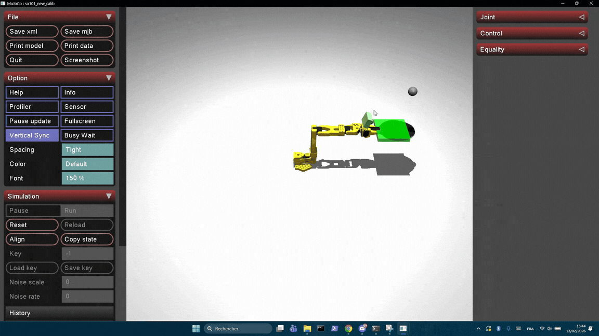

# so101-robotic-learning



-------

## Arborescence

```

├── README.md
├── .gitignore
│
├── assets/                     # Tout ce qui est physique
│   ├── mjcf/
│   │   ├── so101/
│   │   │   ├── robot.xml
│   │   │   ├── actuators.xml
│   │   │   └── scene.xml
│   │   │
│   │   ├── ball.xml
│   │   ├── racket.xml
│   │   └── materials.xml
│   │
│   └── meshes/
│
├── img/
|
├── src/
│   └── bounce_rl/
│       ├── envs/
│       │   ├── bounce_env.py        # Gymnasium env principal
│       │   ├── reset.py             # stratégies de reset
│       │   ├── observations.py
│       │   ├── rewards.py
│       │   ├── events.py            # détection de rebond
│       │   └── termination.py
│       │
│       ├── sim/
│       │   ├── mujoco_loader.py
│       │   ├── controllers.py       # PD / position control
│       │   ├── domain_randomization.py
│       │   └── physics_tuning.py    # restitution, friction…
│       │
│       ├── rl/
│       │   ├── train.py
│       │   ├── eval.py
│       │   ├── callbacks.py
│       │   └── wrappers.py
│       │
│       ├── real_robot/              
│       │   ├── so101_interface.py
│       │   ├── safety_limits.py
│       │   └── calibration.py
│       │
│       ├── perception/
│       │   ├── ball_tracking.py
│       │   ├── kalman.py
│       │   └── latency_compensation.py
│       │
│       ├── configs/
│       │   ├── env.yaml
│       │   ├── sac.yaml
│       │   ├── randomization.yaml
│       │   └── real_robot.yaml
│       │
│       ├── utils/
│       │   ├── seeds.py
│       │   ├── logger.py
│       │   └── paths.py
│       │
│       └── __init__.py
│
├── scripts/
│   ├── train_sim.py
│   ├── eval_sim.py
│   ├── play_policy.py
│   ├── record_video.py
│   └── run_real_robot.py
│
├── notebooks/
├── checkpoints/
├── runs/
├── videos/
│
└── tests/
    ├── test_env.py
    ├── test_rewards.py
    └── test_randomization.py
```
