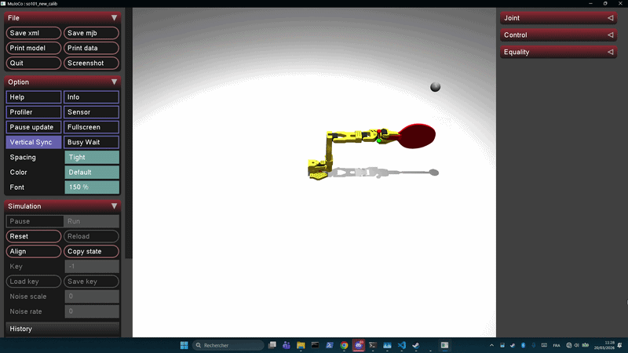
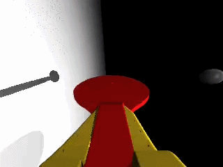
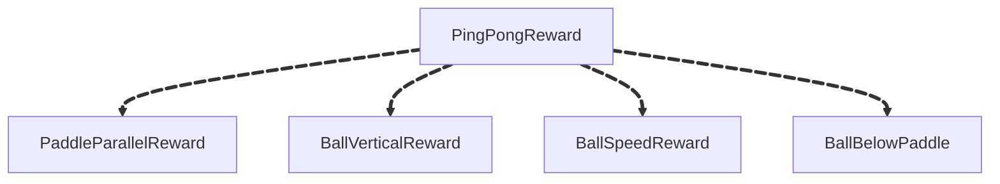

# so101-robotic-learning

<div align="center" style="max-width:900px; margin:auto;">


<p>Env mujoco</p>

<table align="center" width="100%">
  <tr>
  <td align="center" width="50%">
    <br>
    PPO raquette droite
  </td>

  <td align="center" width="50%">
    <br>
    PPO ball on paddle + upper the paddle
    </td>
</tr>
</table>

</div>

<!---

## TODO

- [x] Enregistrer checkpoints model (best_reward)
- [x] Faire en sorte que les entrainement puisse être lancés depuis un notebook (passer en paramètre fichier de config)
- [x] Ajouter etat précédent dans observations env;
- [x] Régler problèmes import en fonction de l'endroit execution fichier;
- [x] Régler problème enregistrement vidéos;
- [ ] Cleaner fichiers train (evolutif, multi env, etc)
  - [x] Mettre tout les paramètres dans trains et tests;
  - [x] Implémenter pour DummyVecEnv;
  - [ ] Implémenter pour SubprocVecEnv;
- [ ] Corriger et faire rewards
  - [ ] Corriger raquette droite pour que ça ne concerne qu'une face de la raquette;
  - [ ] Faire autres rewards ...
    - [ ] Reward position balle comprise dans un espace donné;
    - [ ] Reward position raquette comprise dans un espace donné;
    - [ ] 
- [ ] Tester entrainement avec muli env; 
- [ ] Gridsearch Hyperparamètres;
- [ ] Ajouter variations initialisation env;
  - [ ] implémenter système seed;
  - [ ] Position balle + vecteur vitesse (la traj de la balle doit aller vers la raquette);
  - [ ] Position robot / raquette;
- [ ] Supprimer les informations non relatives au bras (balle par ex)
- [ ] Optimiser execution env ? (tester enlever mesh collision raquette et/ou mesh bras pour voir si grand impact + voir si autres optimisations ex : jax)

## Arborescence

```

├── README.md
├── .gitignore
│
├── assets/                     # Tout ce qui est physique
├── img/
├── notebooks/
|
└── src/
   └── bounce_rl/
       ├── envs/
       │   ├── bounce_env.py        # Gymnasium env principal
       │   ├── reset.py             # stratégies de reset
       │   ├── observations.py
       │   ├── rewards.py
       │   ├── events.py            # détection de rebond
       │   └── termination.py
       │
       ├── sim/
       │   ├── mujoco_loader.py
       │   ├── controllers.py       # PD / position control
       │   ├── domain_randomization.py
       │   └── physics_tuning.py    # restitution, friction…
       │
       ├── rl/
       │   ├── train.py
       │   ├── eval.py
       │   ├── callbacks.py
       │   └── wrappers.py
       │
       ├── real_robot/              
       │   ├── so101_interface.py
       │   ├── safety_limits.py
       │   └── calibration.py
       │
       ├── perception/
       │   ├── ball_tracking.py
       │   ├── kalman.py
       │   └── latency_compensation.py
       │
       ├── configs/
       │   ├── env.yaml
       │   ├── sac.yaml
       │   ├── randomization.yaml
       │   └── real_robot.yaml
       │
       ├── utils/
       │   ├── seeds.py
       │   ├── logger.py
       │   └── paths.py
       │
       └── __init__.py
```

-->

## Setup environnement

```
conda env create -f environment.yml
conda activate so101-robotic-learning
```

## Environnements

### bounce_rl

**bounce_rl** consists of a reinforcement learning environment designed around a bouncing-ball and paddle setup. The goal is to train an agent to control the paddle so as to maintain a stable and continuous bouncing behavior of the ball.

#### *Scripts*

```
cd script/bounce_rl
python [script_name].py
```

- **debug.py :** exemples to launch the **bounce_rl** environment.
- **train_ppo.py :** exemples to train a ppo policy on the **bounce_rl** environment.
- **train_sac.py :** exemples to train a sac policy on the **bounce_rl** environment.
- **test_ppo.py :** exemples to test and vizualise a ppo policy on the **bounce_rl** environment.
- **test_sac.py :** exemples to test and vizualise a sac policy on the **bounce_rl** environment.

#### *Rewards*


```mermaid
  graph TD;
      PingPongReward e1@==> PaddleParallelReward;
      PingPongReward e2@==> BallVerticalReward;
      PingPongReward e3@==> BallSpeedReward;
      PingPongReward e4@==> BallBelowPaddle;

      e1@{ animate: true }
      e2@{ animate: true }
      e3@{ animate: true }
      e4@{ animate: true }
```

##### *Solo*


- **PaddleParallelReward** : Evaluate if the paddle is parallel with the floor.
- **BallVerticalReward** : Evaluate if the ball’s velocity vector is perpendicular to the ground.
- **BallSpeedReward** : Evaluate if the ball’s velocity vector is close to a constent.
- **BallBelowPaddle** : Evaluate if the ball is bellow the paddle.

##### *Combination*

- **PingPongReward** : A multi-objective reward that combines several criteria.

#### *Benchmark*

|   |  REINFORCE | Q-learning  | PPO  |  SAC |
|---|---|---|---|---|
| **PaddleParallelReward** | 32  | 40  | 120  | 150  |
| **BallVerticalReward**  | 32  | 40  | 120  | 150  |
| **BallSpeedReward** | 32  | 40  | 120  | 150  |
| **BallBelowPaddle** | 32  | 40  | 120  | 150  |
| **PingPongReward** | 32  | 40  | 120  | 150  |
