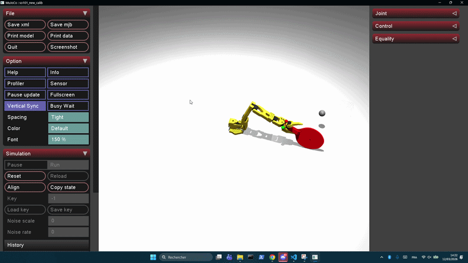
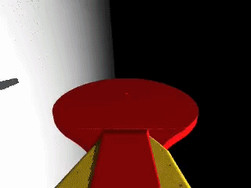
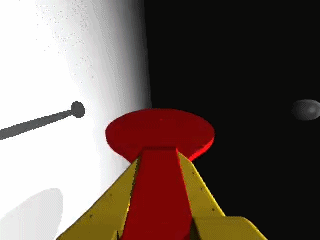

# so101-robotic-learning

<div align="center" style="max-width:900px; margin:auto;">


<p>Env mujoco</p>

<table align="center" width="100%">
  <tr>
  <td align="center" width="50%">
    <br>
    fov 60
  </td>

  <td align="center" width="50%">
    <br>
    fov 100
    </td>
</tr>
</table>

</div>

<!---

## TODO

- [x] package setup (requirements.txt);
- [x] Refactoring code (rename env en bounce_env + cleaner train.py et rewards.py);
- [x] push
- [ ] maj readme.txt
- [ ] push
- [ ] tensorboard;

## Arborescence

```

├── README.md
├── .gitignore
│
├── assets/                     # Tout ce qui est physique
├── img/
├── notebooks/
|
└── src/
   └── bounce_rl/
       ├── envs/
       │   ├── bounce_env.py        # Gymnasium env principal
       │   ├── reset.py             # stratégies de reset
       │   ├── observations.py
       │   ├── rewards.py
       │   ├── events.py            # détection de rebond
       │   └── termination.py
       │
       ├── sim/
       │   ├── mujoco_loader.py
       │   ├── controllers.py       # PD / position control
       │   ├── domain_randomization.py
       │   └── physics_tuning.py    # restitution, friction…
       │
       ├── rl/
       │   ├── train.py
       │   ├── eval.py
       │   ├── callbacks.py
       │   └── wrappers.py
       │
       ├── real_robot/              
       │   ├── so101_interface.py
       │   ├── safety_limits.py
       │   └── calibration.py
       │
       ├── perception/
       │   ├── ball_tracking.py
       │   ├── kalman.py
       │   └── latency_compensation.py
       │
       ├── configs/
       │   ├── env.yaml
       │   ├── sac.yaml
       │   ├── randomization.yaml
       │   └── real_robot.yaml
       │
       ├── utils/
       │   ├── seeds.py
       │   ├── logger.py
       │   └── paths.py
       │
       └── __init__.py
```

-->

## Setup environnement

```
conda env create -f environment.yml
conda activate so101-robotic-learning
```

## Bounce_rl

Bounce_rl consist to 

### Rewards

**PingPongReward** : Multi objective reward.

### Benchmark

|   |  REINFORCE | Q-learning  | PPO  |  SAC |
|---|---|---|---|---|
|  **PingPongReward** | 32  | 40  | 120  | 150  |
